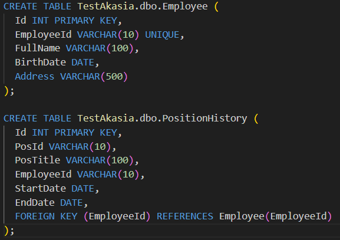
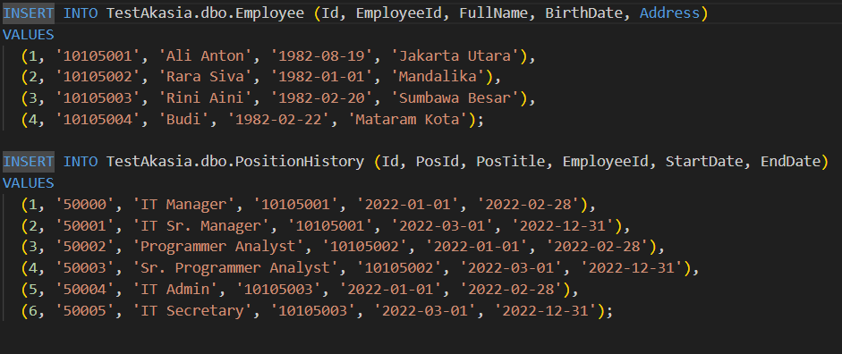
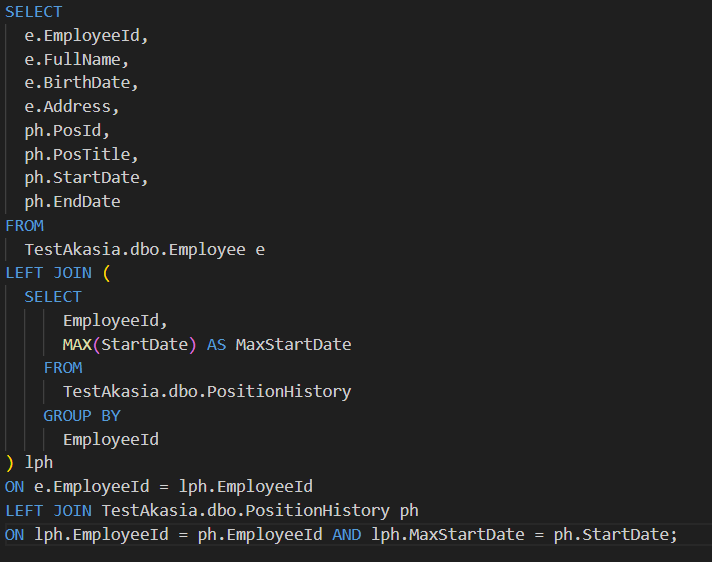
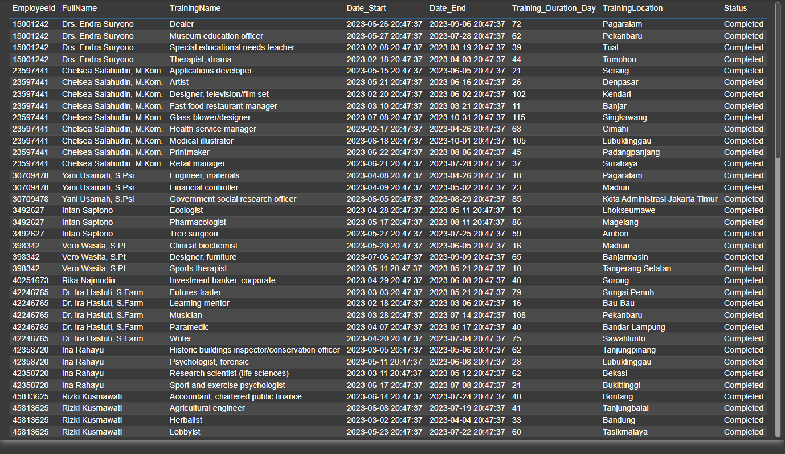
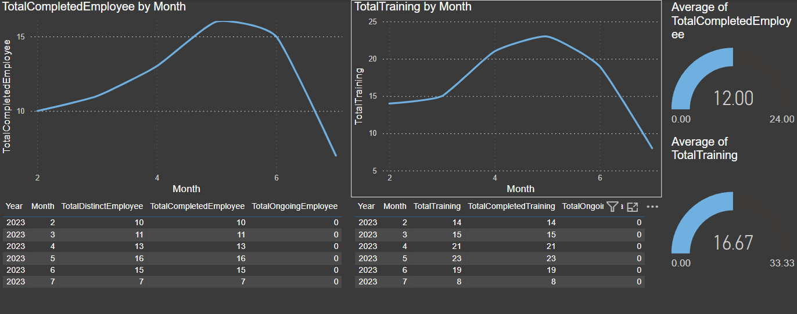

# Akasia-Assesment-Test

## Introduction
This repository comprises Python and SQL scripts tailored to meet the requirements outlined for the assessment. Additionally, there are two folders included in this repository: "data_and_query_task" and "etl_data_warehouse_and_analytics_task," each containing scripts specific to their respective tasks.

## Data and Query Task(Basic)

- Creating Table Scripts:
  - The first task involves generating scripts to create tables for two distinct objects: Employee and PositionHistory. These scripts will define the structure and attributes of each table, laying the foundation for storing relevant data.

  

  
 

- Inserting Data Scripts:
  - Following the table creation, the next task focuses on creating insert scripts. These scripts are essential for populating the tables with data. Specifically, there will be scripts developed to insert data into both the Employee and PositionHistory tables.
  
  

  
 

- Query for Employee Data Display:
  - Lastly, a query will be crafted to retrieve and display comprehensive employee information. This query will include details such as EmployeeId, FullName, BirthDate, and Address. Additionally, it will incorporate the current position information of each employee, including PosId, PosTitle, StartDate, and EndDate. This comprehensive query will provide insights into both the employees and their current positions.

  

  
 

## ETL, Data Warehouse and Analytics Task
- Azure Employee Data:
  - The employee data resides in an Azure SQL Server database. This database is dedicated to storing information regarding employees' employment details, such as their employee number, name, birthdate, position/job, etc. Each employee is represented by a single record containing their employment data.
- Training History Data:
  - The training history data is stored in a Google Worksheet, serving as the data platform. This worksheet contains historical records of training completed by employees. Unlike the employment data, each employee may have multiple records in the training history, reflecting their participation in various training activities over time.
- ETL Flow Design:
  - The task involves designing a simple Extract, Transform, Load (ETL) flow to integrate these two disparate data sources into a unified Data Warehouse. This process ensures that relevant employee and training data from both Azure SQL Server and Google Worksheet are consolidated and made available for analysis and reporting purposes.

  The Script that handle that is `etl_data_warehouse_and_analytics_task/googlesheets_etl.py`
  `etl_data_warehouse_and_analytics_task/sql_server_etl.py` 

- Report Design:
  - Designing a straightforward report that presents the historical training data. This report will likely include details such as the types of training completed, dates of completion, participants involved, and any other relevant information extracted from the training history data.
- Dashboard Design:
  - Creating a simple dashboard that provides key insights into the training activities:
    - Total number of employees who completed training each month.

      

        
      

    - Total number of training sessions conducted each month.

      

        
      

